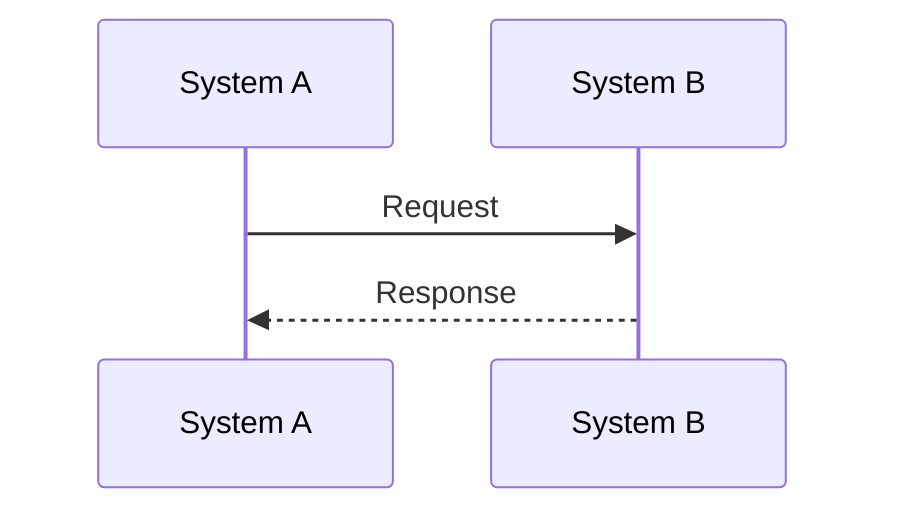

# Sequence Diagrams

This directory contains comprehensive sequence diagrams that visualize the key workflows and interactions within the Adobe Brand Store App Builder system.

## 📊 Available Diagrams

### 1. [Payment Processing Flow](./01-payment-processing-flow.md)
**Purpose**: Shows the complete payment processing workflow from cart to payment completion.

**Key Interactions**:
- Cart addition and management
- Payment validation and processing
- Authorize.net integration
- Order status updates
- State management and caching

**Use Cases**:
- Understanding payment gateway integration
- Debugging payment processing issues
- Planning payment flow enhancements

### 2. [Shipping Calculator Flow](./02-shipping-calculator-flow.md)
**Purpose**: Visualizes the shipping calculation process with multi-carrier integration.

**Key Interactions**:
- Multi-carrier rate calculation (UPS, FedEx, USPS)
- Tax calculation integration
- Shipping method selection
- Rate caching and optimization

**Use Cases**:
- Understanding shipping carrier integrations
- Optimizing shipping calculation performance
- Adding new shipping carriers

### 3. [Order Processing Flow](./03-order-processing-flow.md)
**Purpose**: Shows the complete order lifecycle from creation to fulfillment.

**Key Interactions**:
- Order creation and ERP integration
- Inventory management and allocation
- Shipping label generation
- Invoice creation and management

**Use Cases**:
- Understanding order processing workflow
- Planning ERP system integrations
- Optimizing fulfillment processes

### 4. [Inventory Synchronization Flow](./04-inventory-sync-flow.md)
**Purpose**: Visualizes inventory synchronization between ERP and Adobe Commerce.

**Key Interactions**:
- SFTP file processing
- Real-time inventory updates
- Stock level synchronization
- Cache management

**Use Cases**:
- Understanding inventory sync processes
- Troubleshooting inventory issues
- Planning inventory optimization

### 5. [Authentication Flow](./05-authentication-flow.md)
**Purpose**: Shows the authentication and authorization workflow.

**Key Interactions**:
- SSO login process
- Adobe IMS integration
- Customer group management
- Session management

**Use Cases**:
- Understanding authentication security
- Planning user management features
- Debugging authentication issues

### 6. [CI/CD Deployment Flow](./06-ci-cd-deployment-flow.md)
**Purpose**: Visualizes the complete deployment pipeline from code to production.

**Key Interactions**:
- GitHub Actions workflows
- Testing and quality gates
- Staging and production deployments
- Health monitoring

**Use Cases**:
- Understanding deployment processes
- Planning CI/CD improvements
- Troubleshooting deployment issues

## 🔧 How to Use These Diagrams

### For Developers
- **Onboarding**: Use diagrams to understand system architecture
- **Debugging**: Reference diagrams when troubleshooting issues
- **Planning**: Use diagrams for feature planning and implementation

### For Architects
- **System Design**: Reference diagrams for system design decisions
- **Integration Planning**: Use diagrams for third-party integration planning
- **Performance Optimization**: Identify bottlenecks and optimization opportunities

### For DevOps
- **Deployment Planning**: Use CI/CD diagram for deployment strategy
- **Monitoring Setup**: Reference diagrams for monitoring configuration
- **Troubleshooting**: Use diagrams for deployment issue resolution

### For Product Managers
- **Feature Planning**: Understand system capabilities and limitations
- **Stakeholder Communication**: Use diagrams for technical communication
- **Requirement Analysis**: Reference diagrams for requirement gathering

## 📝 Diagram Maintenance

### When to Update Diagrams
- **New Features**: Update relevant diagrams when adding new functionality
- **Architecture Changes**: Update diagrams when system architecture changes
- **Integration Updates**: Update diagrams when third-party integrations change
- **Process Changes**: Update diagrams when workflows are modified

### How to Update Diagrams
1. **Identify Impact**: Determine which diagrams are affected by changes
2. **Update Mermaid Code**: Modify the Mermaid sequence diagram code
3. **Update Documentation**: Update the accompanying documentation
4. **Review Changes**: Have team review updated diagrams
5. **Version Control**: Commit changes with descriptive commit messages

## 🛠️ Technical Details

### Mermaid Syntax
All diagrams use [Mermaid](https://mermaid.js.org/) syntax for sequence diagrams. Key syntax elements:

### Diagram Components
- **Participants**: Systems, services, and external APIs
- **Messages**: Requests and responses between participants
- **Notes**: Additional context and explanations
- **Error Handling**: Error scenarios and recovery

### Best Practices
- **Clarity**: Keep diagrams focused and easy to understand
- **Completeness**: Include all relevant interactions
- **Accuracy**: Ensure diagrams reflect actual system behavior
- **Maintenance**: Keep diagrams up-to-date with system changes

## 🔗 Related Documentation

- [Project Overview](../../README.md)
- [Comprehensive Documentation](../../ADOBE_STORE_COMPREHENSIVE_DOCUMENTATION.md)
- [Actions Documentation](../../actions-documentation/)
- [Library Documentation](../../lib-documentation/)
- [Scripts Documentation](../../scripts-documentation/)

## 📞 Support

For questions about these diagrams or to request new diagrams:
- **Technical Issues**: Create an issue in the repository
- **Documentation Updates**: Submit a pull request
- **Architecture Questions**: Contact the development team

---

*Last Updated: [Current Date]*
*Version: 1.0* 
