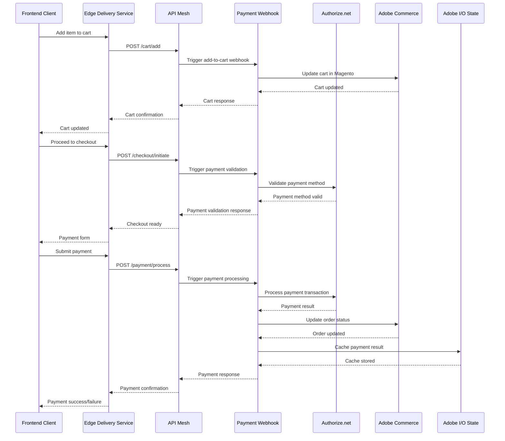

# Payment Processing Flow Sequence Diagram

## Overview
This diagram shows the complete payment processing flow from cart to payment completion, including webhook handling and payment gateway integration.

## Key Components

### Payment Webhook (`actions/commerce/webhook/payment/`)
- **validate.js**: Validates payment data before processing
- **filter.js**: Filters and routes payment requests
- **accept-payment-transaction-client.js**: Handles Authorize.net integration

### Payment Processing Steps
1. **Cart Addition**: Items added to cart via webhook
2. **Checkout Initiation**: Payment validation and method verification
3. **Payment Processing**: Transaction processing through Authorize.net
4. **Order Update**: Commerce system updated with payment result
5. **State Management**: Payment result cached for future reference

### Error Handling
- Payment validation failures
- Gateway communication errors
- Order update failures
- State management errors

### Security Considerations
- OAuth 1.0a authentication
- Webhook signature verification
- Payment data encryption
- Secure state management 
