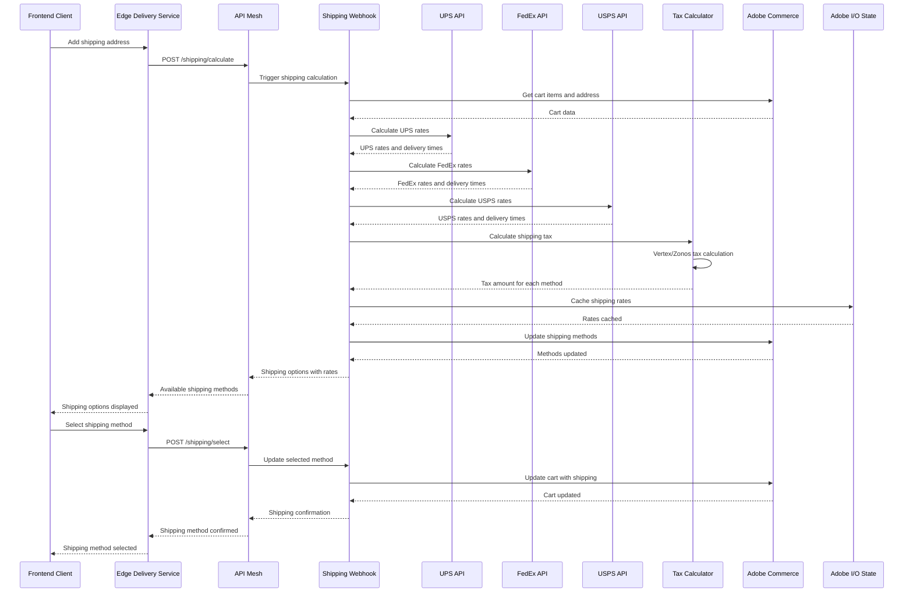

# Shipping Calculator Flow Sequence Diagram

## Overview
This diagram shows the shipping calculation flow from cart to shipping method selection, including multi-carrier integration and tax calculation.

## Key Components

### Shipping Webhook (`actions/commerce/webhook/shipping/`)
- **index.js**: Main shipping calculation orchestrator
- **validation.js**: Validates shipping addresses and requirements
- **methods/**: Carrier-specific implementations
  - **ups.js**: UPS API integration
  - **fedex.js**: FedEx API integration
  - **usps.js**: USPS API integration
  - **warehouse.js**: Custom warehouse shipping
  - **carrier.js**: Generic carrier interface

### Tax Integration (`actions/commerce/webhook/tax/`)
- **calculate.js**: Main tax calculation orchestrator
- **vertex/**: Vertex tax service integration
- **zonos/**: Zonos tax service integration

### Shipping Calculation Steps
1. **Address Validation**: Validate shipping address format
2. **Multi-Carrier Rate Calculation**: Get rates from UPS, FedEx, USPS
3. **Tax Calculation**: Calculate taxes for each shipping method
4. **Rate Caching**: Cache calculated rates for performance
5. **Method Selection**: User selects preferred shipping method

### Error Handling
- Invalid shipping addresses
- Carrier API failures
- Tax calculation errors
- Rate caching failures

### Performance Optimizations
- Rate caching in Adobe I/O State
- Parallel carrier API calls
- Tax calculation optimization
- Shipping method filtering 
