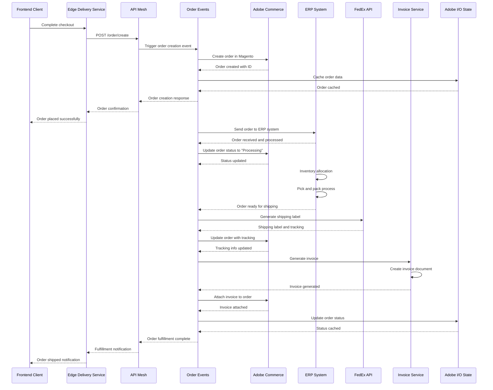

# Order Processing Flow Sequence Diagram

## Overview
This diagram shows the complete order processing flow from order creation to fulfillment, including ERP integration and shipping label generation.

## Key Components

### Order Events (`actions/commerce/events/order/`)
- **create/index.js**: Handles order creation process
- **status/index.js**: Manages order status updates
- **fedex/index.js**: FedEx integration for shipping labels
- **invoice/create.js**: Invoice generation service
- **client/soap_client.js**: ERP system integration

### Order Processing Steps
1. **Order Creation**: Order created in Commerce system
2. **ERP Integration**: Order sent to ERP for processing
3. **Inventory Management**: Stock allocation and pick/pack
4. **Shipping Label Generation**: FedEx label creation
5. **Invoice Generation**: Automatic invoice creation
6. **Status Updates**: Real-time status tracking

### ERP Integration
- **SOAP Client**: Handles ERP system communication
- **Order Synchronization**: Bidirectional order sync
- **Inventory Updates**: Real-time stock updates
- **Status Synchronization**: Order status tracking

### Error Handling
- Order creation failures
- ERP communication errors
- Shipping label generation failures
- Invoice generation errors
- Status synchronization issues

### State Management
- Order data caching
- Status tracking
- Error state management
- Retry mechanisms 
