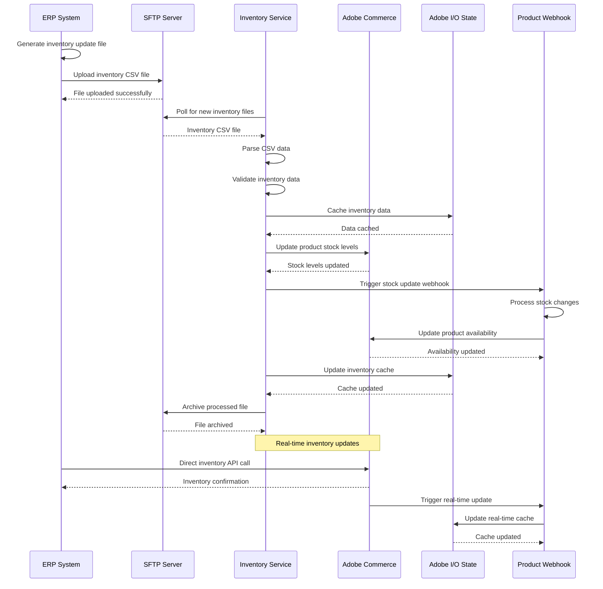

# Inventory Synchronization Flow Sequence Diagram

## Overview
This diagram shows the inventory synchronization flow from ERP system to Adobe Commerce, including SFTP file processing and real-time updates.

## Key Components

### Inventory Service (`actions/commerce/inventory/`)
- **index.js**: Main inventory synchronization orchestrator
- **update-inventory-service.js**: Handles inventory update processing
- **SFTP Integration**: Secure file transfer for inventory data
- **CSV Processing**: Parse and validate inventory files

### Inventory Synchronization Steps
1. **File Generation**: ERP generates inventory CSV file
2. **SFTP Upload**: File uploaded to SFTP server
3. **File Processing**: Inventory service polls and processes files
4. **Data Validation**: Validate inventory data integrity
5. **Commerce Update**: Update stock levels in Adobe Commerce
6. **Webhook Trigger**: Trigger product availability updates
7. **Cache Update**: Update cached inventory data
8. **File Archival**: Archive processed files

### Real-time Updates
- **Direct API Calls**: ERP to Commerce direct updates
- **Webhook Triggers**: Real-time availability updates
- **Cache Synchronization**: Keep cached data current
- **State Management**: Track inventory changes

### Error Handling
- SFTP connection failures
- File parsing errors
- Data validation failures
- Commerce update failures
- Cache synchronization errors

### Performance Optimizations
- Batch processing of inventory updates
- Incremental updates for efficiency
- Caching for performance
- File archival for storage management 
