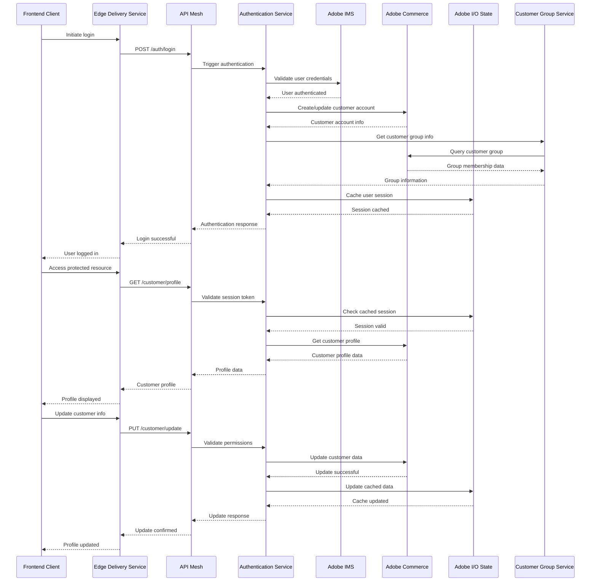

# Authentication Flow Sequence Diagram

## Overview
This diagram shows the authentication flow including SSO login, customer group management, and Adobe IMS integration.

## Key Components

### Authentication Service (`actions/account/`)
- **ssologin.js**: Handles SSO login process
- **validator.js**: Validates authentication data
- **schema.json**: Defines authentication schemas

### Customer Management (`actions/commerce/customer/`)
- **group/index.js**: Customer group management
- **group-name/index.js**: Group name resolution
- **contact-us/**: Contact form processing

### Authentication Steps
1. **Login Initiation**: User initiates login process
2. **Adobe IMS Validation**: Validate credentials with Adobe IMS
3. **Customer Account Creation**: Create/update customer in Commerce
4. **Group Assignment**: Determine customer group membership
5. **Session Caching**: Cache user session data
6. **Profile Management**: Handle customer profile operations

### Security Features
- **OAuth 1.0a**: Secure authentication protocol
- **Session Management**: Secure session handling
- **Permission Validation**: Role-based access control
- **Data Encryption**: Secure data transmission

### Error Handling
- Authentication failures
- Session expiration
- Permission denied errors
- Account creation failures
- Group assignment errors

### State Management
- User session caching
- Profile data caching
- Group membership caching
- Authentication token management 
