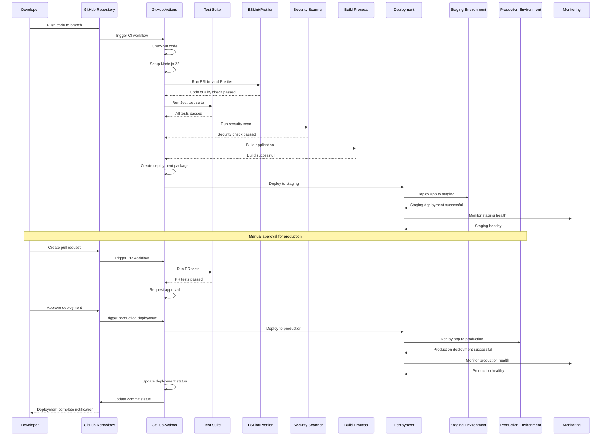

# CI/CD Deployment Flow Sequence Diagram

## Overview
This diagram shows the complete CI/CD deployment flow from code commit to production deployment, including testing, security scanning, and environment management.

## Key Components

### GitHub Actions Workflows
- **Node CI Tests** (`.github/workflows/ci.yml`): Automated testing and quality checks
- **Production Deployment** (`.github/workflows-samples/deploy_prod.yml`): Production deployment pipeline
- **Staging Deployment** (`.github/workflows-samples/deploy_stage.yml`): Staging deployment pipeline
- **Pull Request Testing** (`.github/workflows-samples/pr_test.yml`): PR validation

### CI/CD Pipeline Steps
1. **Code Quality**: ESLint and Prettier checks
2. **Testing**: Jest test suite execution
3. **Security**: Security vulnerability scanning
4. **Building**: Application build process
5. **Staging Deployment**: Deploy to staging environment
6. **Health Monitoring**: Verify deployment health
7. **Production Deployment**: Deploy to production (with approval)
8. **Status Updates**: Update deployment status

### Environment Management
- **Staging Environment**: Pre-production testing
- **Production Environment**: Live application
- **Environment Variables**: Secure configuration management
- **Secrets Management**: Secure credential storage

### Security Features
- **Code Quality Gates**: Prevent poor quality code
- **Security Scanning**: Vulnerability detection
- **Approval Workflows**: Manual approval for production
- **Secrets Protection**: Secure credential handling

### Monitoring and Observability
- **Health Checks**: Application health monitoring
- **Deployment Status**: Real-time deployment tracking
- **Error Reporting**: Deployment failure notifications
- **Performance Monitoring**: Application performance tracking

### Error Handling
- **Build Failures**: Automatic rollback and notification
- **Test Failures**: Block deployment until fixed
- **Security Issues**: Block deployment for vulnerabilities
- **Deployment Failures**: Automatic rollback procedures 
